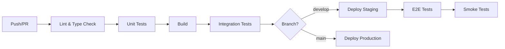

# BaseBook DEX - Docker & CI/CD Documentation

## Table of Contents
- [Quick Start](#quick-start)
- [Docker Setup](#docker-setup)
- [CI/CD Pipeline](#cicd-pipeline)
- [Development Workflow](#development-workflow)
- [Production Deployment](#production-deployment)
- [Monitoring](#monitoring)
- [Troubleshooting](#troubleshooting)

## Quick Start

### Prerequisites
- Docker 24.0+
- Docker Compose 2.20+
- Node.js 20+ (for local development)
- Rust 1.75+ (for router development)

### Start Development Environment

```bash
# Clone repository
git clone https://github.com/basebook/basebook-dex.git
cd basebook-dex

# Copy environment files
cp .env.example .env

# Start all services
./scripts/docker-up.sh

# Or manually
docker-compose up -d
```

### Access Services
- **Frontend**: http://localhost:3000
- **Backend API**: http://localhost:4000
- **Router**: http://localhost:8080
- **PostgreSQL**: localhost:5432
- **Redis**: localhost:6379
- **Grafana**: http://localhost:3001 (admin/admin)
- **Prometheus**: http://localhost:9090

## Docker Setup

### Architecture

```
┌─────────────────────────────────────────────────────────────┐
│                       Load Balancer                         │
│                     (Nginx / Cloudflare)                    │
└─────────────────────────┬───────────────────────────────────┘
                          │
        ┌─────────────────┼─────────────────┐
        │                 │                 │
        ▼                 ▼                 ▼
┌──────────────┐  ┌──────────────┐  ┌──────────────┐
│   Frontend   │  │   Backend    │  │    Router    │
│   (Next.js)  │  │  (Node.js)   │  │    (Rust)    │
└──────┬───────┘  └──────┬───────┘  └──────────────┘
       │                 │
       │                 ├──────────┐
       │                 │          │
       ▼                 ▼          ▼
┌──────────────┐  ┌──────────────┐ ┌──────────────┐
│  PostgreSQL  │  │    Redis     │ │  The Graph   │
└──────────────┘  └──────────────┘ └──────────────┘
```

### Service Descriptions

#### Frontend (Next.js)
- **Image**: `ghcr.io/basebook/frontend`
- **Port**: 3000
- **Resources**: 1 CPU, 1GB RAM
- **Purpose**: User-facing web application

#### Backend (Node.js)
- **Image**: `ghcr.io/basebook/backend`
- **Port**: 4000
- **Resources**: 1 CPU, 1GB RAM (3 replicas in prod)
- **Purpose**: REST API, WebSocket server, business logic

#### Router (Rust)
- **Image**: `ghcr.io/basebook/router`
- **Port**: 8080
- **Resources**: 2 CPU, 2GB RAM
- **Purpose**: Optimal path finding, swap simulation

#### PostgreSQL
- **Image**: `postgres:15-alpine`
- **Port**: 5432
- **Volume**: `postgres_data`
- **Purpose**: Primary database

#### Redis
- **Image**: `redis:7-alpine`
- **Port**: 6379
- **Volume**: `redis_data`
- **Purpose**: Cache, pub/sub, rate limiting

#### The Graph Node
- **Image**: `graphprotocol/graph-node`
- **Ports**: 8000, 8001, 8020, 8030, 8040
- **Purpose**: Blockchain data indexing

### Docker Compose Files

#### `docker-compose.yml` (Development)
Full local development stack with hot reload and debugging enabled.

```bash
docker-compose up -d
```

#### `docker-compose.test.yml` (Testing)
Isolated environment for E2E testing.

```bash
docker-compose -f docker-compose.test.yml up -d
```

#### `docker-compose.prod.yml` (Production)
Production-optimized configuration with resource limits and replicas.

```bash
docker-compose -f docker-compose.prod.yml up -d
```

### Building Images

#### Build All Services
```bash
docker-compose build
```

#### Build Specific Service
```bash
docker-compose build backend
```

#### Build with No Cache
```bash
docker-compose build --no-cache
```

### Multi-Stage Builds

All Dockerfiles use multi-stage builds for optimal image size:

**Backend Example**:
1. **deps**: Install production dependencies
2. **builder**: Install dev dependencies and build
3. **runner**: Copy built app with production dependencies only

**Result**: ~200MB final image (vs ~1GB without multi-stage)

## CI/CD Pipeline

### GitHub Actions Workflows

#### `main.yml` - Main Pipeline
Runs on every push and PR to `main` and `develop`.

**Jobs**:
1. **contracts**: Build and test smart contracts (Foundry)
2. **backend**: Lint, type check, test, build backend
3. **router**: Lint, test, build Rust router
4. **frontend**: Lint, type check, test, build frontend
5. **security**: Run Trivy vulnerability scanner
6. **docker**: Build and push Docker images (on push only)

**Badges**:
```markdown

```

#### `e2e.yml` - E2E Tests
Runs E2E tests with Playwright.

**Trigger**:
- Push to main/develop
- PRs
- Daily at 2 AM UTC (scheduled)

**Steps**:
1. Start services with `docker-compose.test.yml`
2. Wait for services to be ready
3. Run Playwright tests
4. Upload test results and reports

### Pipeline Flow



### Environment Secrets

Required GitHub Secrets:
- `AWS_ACCESS_KEY_ID`: AWS credentials for ECR
- `AWS_SECRET_ACCESS_KEY`: AWS secret key
- `CODECOV_TOKEN`: Codecov upload token
- `SENTRY_DSN`: Sentry error tracking

### Deployment Targets

#### Staging (develop branch)
- **URL**: https://staging.basebook.xyz
- **Auto-deploy**: Yes
- **Approval**: Not required

#### Production (main branch)
- **URL**: https://basebook.xyz
- **Auto-deploy**: No
- **Approval**: Required (manual)

## Development Workflow

### Local Development

#### 1. Start Services
```bash
./scripts/docker-up.sh
```

#### 2. View Logs
```bash
# All services
docker-compose logs -f

# Specific service
docker-compose logs -f backend
```

#### 3. Execute Commands in Containers
```bash
# Backend shell
docker-compose exec backend sh

# Run migrations
docker-compose exec backend npm run migrate

# Frontend shell
docker-compose exec frontend sh
```

#### 4. Rebuild Service
```bash
docker-compose up -d --build backend
```

#### 5. Stop Services
```bash
./scripts/docker-down.sh
```

### Hot Reload

All services support hot reload in development:
- **Frontend**: Next.js Fast Refresh
- **Backend**: nodemon
- **Router**: cargo watch (requires local setup)

### Database Migrations

```bash
# Generate migration
docker-compose exec backend npm run db:generate

# Run migrations
docker-compose exec backend npm run db:migrate

# Seed database
docker-compose exec backend npm run db:seed
```

### Running Tests

#### Unit Tests
```bash
# Backend
docker-compose exec backend npm run test:unit

# Frontend
docker-compose exec frontend npm run test

# Router (requires local Rust)
cd router && cargo test
```

#### Integration Tests
```bash
docker-compose exec backend npm run test:integration
```

#### E2E Tests
```bash
# Start test stack
docker-compose -f docker-compose.test.yml up -d

# Run tests
cd frontend && npm run test:e2e

# Cleanup
docker-compose -f docker-compose.test.yml down -v
```

## Production Deployment

### Prerequisites
- Kubernetes cluster OR Docker Swarm
- External PostgreSQL (RDS, Cloud SQL)
- External Redis (ElastiCache, Cloud Memorystore)
- Load Balancer (ALB, NLB)
- CDN (Cloudflare)

### Using Docker Compose (Small Scale)

```bash
# Pull latest images
docker-compose -f docker-compose.prod.yml pull

# Start services
docker-compose -f docker-compose.prod.yml up -d

# Scale backend replicas
docker-compose -f docker-compose.prod.yml up -d --scale backend=3
```

### Using Kubernetes (Recommended)

See `k8s/` directory for Kubernetes manifests.

```bash
# Apply configurations
kubectl apply -f k8s/

# Check status
kubectl get pods -n basebook

# View logs
kubectl logs -f deployment/backend -n basebook
```

### Health Checks

All services expose health endpoints:

```bash
# Backend
curl http://localhost:4000/health

# Router
curl http://localhost:8080/health

# Frontend
curl http://localhost:3000/api/health
```

### Rolling Updates

```bash
# Update backend image
docker-compose -f docker-compose.prod.yml pull backend
docker-compose -f docker-compose.prod.yml up -d backend

# Zero-downtime with Kubernetes
kubectl rollout restart deployment/backend -n basebook
kubectl rollout status deployment/backend -n basebook
```

## Monitoring

### Prometheus Metrics

Access Prometheus at http://localhost:9090

**Key Metrics**:
- `http_requests_total`: Total HTTP requests
- `http_request_duration_seconds`: Request latency
- `router_paths_found`: Successful routing operations
- `db_connections_active`: Active database connections

### Grafana Dashboards

Access Grafana at http://localhost:3001 (admin/admin)

**Dashboards**:
1. **Overview**: System-wide metrics
2. **API Performance**: Request rates, latencies, errors
3. **Router Performance**: Path finding performance
4. **Database**: Connection pool, query performance
5. **Infrastructure**: CPU, memory, disk

### Alerts

Configure alerts in `monitoring/prometheus/rules/`:

```yaml
- alert: HighErrorRate
  expr: rate(http_requests_total{status=~"5.."}[5m]) > 0.05
  for: 5m
  labels:
    severity: critical
  annotations:
    summary: High error rate detected
```

### Logs

**View logs**:
```bash
docker-compose logs -f [service]
```

**Export logs** (production):
- Use Loki for aggregation
- Export to ELK stack
- Stream to CloudWatch/Stackdriver

## Troubleshooting

### Common Issues

#### Port Already in Use
```bash
# Find process using port
lsof -i :3000

# Kill process
kill -9 <PID>
```

#### Services Not Starting
```bash
# Check logs
docker-compose logs [service]

# Rebuild without cache
docker-compose build --no-cache [service]
```

#### Database Connection Issues
```bash
# Check PostgreSQL is running
docker-compose ps postgres

# Check database logs
docker-compose logs postgres

# Test connection
docker-compose exec backend npx drizzle-kit studio
```

#### Out of Disk Space
```bash
# Clean up unused images
docker system prune -a

# Remove volumes
docker volume prune

# Remove all stopped containers
docker container prune
```

#### Performance Issues
```bash
# Check resource usage
docker stats

# Increase resources in Docker Desktop
# Settings > Resources > Advanced
```

### Debug Mode

Enable debug logging:

```bash
# Backend
docker-compose exec backend sh
export LOG_LEVEL=debug
npm run dev

# Frontend
docker-compose exec frontend sh
export NEXT_PUBLIC_DEBUG=true
npm run dev
```

### Reset Everything

```bash
# Stop all services
docker-compose down -v

# Remove all containers, images, volumes
docker system prune -a --volumes

# Start fresh
./scripts/docker-up.sh
```

## Best Practices

### Security
- Never commit `.env` files
- Use secrets management (Vault, AWS Secrets Manager)
- Scan images regularly (`docker scan`)
- Use non-root users in containers
- Keep base images updated

### Performance
- Use multi-stage builds
- Minimize layer count
- Use `.dockerignore`
- Cache dependencies
- Use health checks

### Reliability
- Always define resource limits
- Use restart policies
- Implement proper health checks
- Use readiness probes
- Monitor container metrics

### Development
- Use bind mounts for hot reload
- Keep dev/prod parity
- Document all environment variables
- Use docker-compose for consistency

## Resources

- [Docker Documentation](https://docs.docker.com/)
- [Docker Compose Reference](https://docs.docker.com/compose/compose-file/)
- [Best Practices](https://docs.docker.com/develop/dev-best-practices/)
- [GitHub Actions](https://docs.github.com/en/actions)

---

**Questions?** Open an issue on GitHub or contact the DevOps team.
